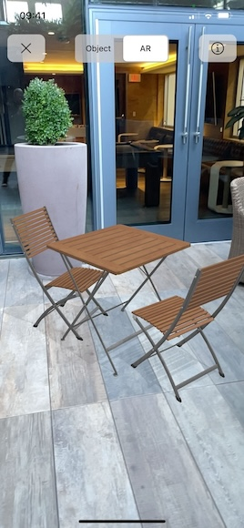

# Khronos glTF Viewer

## Overview

The Khronos glTF Viewer is an easy-to-use application that lets you view and interact with 3D models in the Khronos glTF 2.0 file format, and includes support for viewing in augmented reality.  

[glTF](https://www.khronos.org/gltf/) is the open, industry-standard 3D asset format for the efficient transmission and loading of 3D scenes and models by engines and applications. It is an ISO/IEC International Standard that has become the 3D asset delivery format of choice across the web and real-time applications.

## Features

Key App Features:

 - Built-In Sample Models – View sample glTF models showcasing features like physically-based rendering and animation
 - Object Mode – Rotate, zoom, or pan a 3D model to view it from various angles
 - AR Mode – Place a 3D model on real-world surfaces with augmented reality
 - File Browser – Browse and display your own glTF files, including optional integration with iCloud Drive

  
_The launch screen_

  
_A model of chairs and a table viewed in Object Mode_

  
_A model of chairs and a table placed in the real world and viewed in AR Mode_

All the features found in the core glTF 2.0 specification are supported, plus a number of glTF extensions, including Physically Based Rendering (PBR) effects such as clearcoat.

The list of supported extensions includes

 - EXT_meshopt_compression
 - KHR_draco_mesh_compression
 - KHR_lights_punctual
 - KHR_materials_clearcoat
 - KHR_materials_unlit
 - KHR_mesh_quantization
 - KHR_texture_basisu
 - KHR_texture_transform

This reference application is an Open Source project supported by the Khronos Group and released under an Apache 2.0 license.  Developers are invited to contribute to the ongoing development of the project and provide feedback by raising [issues](https://github.com/KhronosGroup/glTF-iOS-Viewer/issues) on the GitHub repository.  Developers may also create derivative works based on the application, subject to the terms of the Apache 2.0 license.

## Building the App

The provided Xcode project enables you to build the app yourself, but there are a few more steps to take if you wish to deploy the app to a device or redistribute it.

 - For each target in the project, under the Signing & Capabilities section, set the signing Team to your own team
 - If you wish to use iCloud document sharing, add the iCloud entitlement to the "glTFViewer" target and replace all references to the official app's iCloud container (`iCloud.org.khronos.gltf.glTFViewer`) with your own container name. iCloud support is optional, and the app will fall back to the app's container for document storage in its absence.

The project makes use of a number of Swift packages, so you will need to be connected to the Internet the first time these packages are fetched.